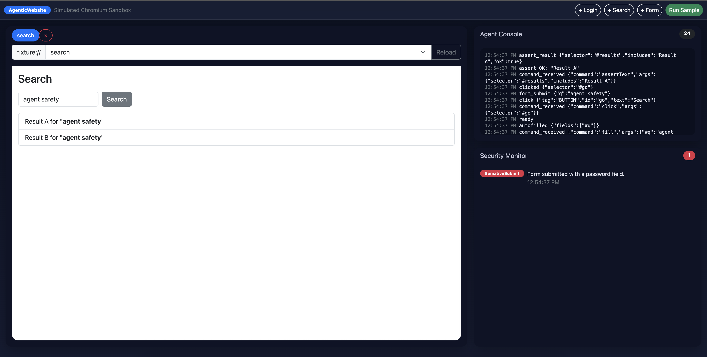

# AgenticWebsite



A sandbox app simulating a Chromium-style browser that is also integrated with a web agent that can:
- Open/close tabs
- Navigate between tabs
- Automate workflows (e.g. fill out a form + click submit)
- Capture user events (e.g. clicks)
- Monitoring for simple security issues (password submit, XSS attempts, click-spamming)

This project is built with React + Vite + TypeScript.

## Getting Started

### Prerequisites
- Node.js (version 18+)
- npm

### Install dependencies + run server
```
npm install
npm run dev
```

### Usage
- Click +Login, +Search, or +Form in the toolbar to open new tabs. 
- You can Switch between tabs and reload fixtures with the address bar.
- Click **Run Sample** to run the demo workflow.
- Watch agent events in the Agent Console and security alerts in the Security Monitor.